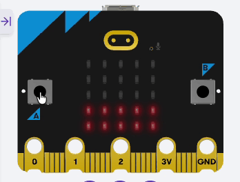

# StartSignal-Duel
A BBC micro:bit Project — An app for two players to compete in reaction time,
inspired by the F1 start signal. Five lights illuminate in sequence; when the
lights out, it's the start signal.



## Development Environment
This program runs in MicroPython within the
[micro:bit Python Editor](https://python.microbit.org/v/3). (Not tested in 
Python within the [MakeCode editor](https://makecode.microbit.org/#editor))

## Setting up a Python Development Environment

### Create and activate virtual environment(venv)
```bash
# create virtual environment
$ python -m venv .venv
# activate for Windows
$ .venv/bin/activate 
# activate for macOS / Linux
$ source .venv/bin/activate
```

### To Upgrade pip [if necessary]
```bash
$ pip install --upgrade pip
```

### Installing development dependency packages
```bash
$ pip install -r requirements-dev.txt
```

### Linting source files
```bash
$ flake8 source_files...
```
